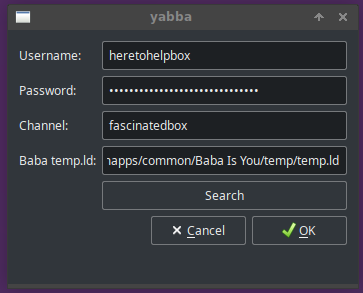
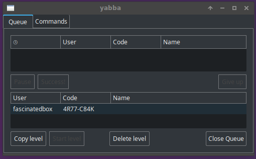
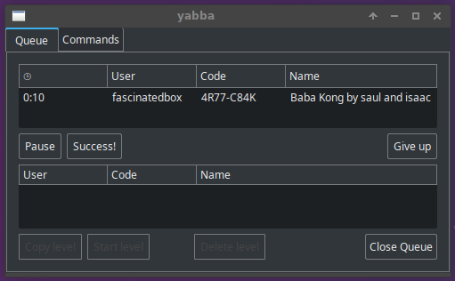
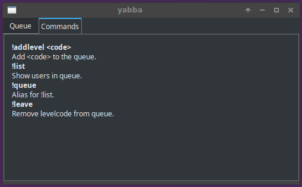
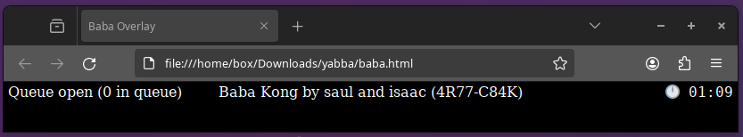

yabba
=====

### Overview

Yabba is a queue management system for Twitch streamers who want to allow
viewers to send custom levelcodes.

### Why

Before writing Yabba, I briefly used Nightbot along with a queue script to
create a levelcode queue. Yabba provides the following advantages to using a
text-only queue:

**How long have I been here?**: Some custom Baba levels are very challenging
to solve in a time frame that gives everyone a chance. Yabba includes a timer
that shows on the overlay as well as in the program.

**What's the current levelcode?**: Yabba includes an overlay that specifies the
levelcode used as well as a level's name and author.

**Auto copy levelcode**: Yabba loads the levelcode automatically into the
clipboard, no need to hunt through a (busy!) chat.

### How it works

Yabba begins by connecting to a twitch bot account that you supply (mine is
provided for reference). You must connect to it with that bot account's oauth
token. The token looks like this: `oauth:...`.

Yabba listens for the commands mention in the command tab and answers
accordingly. A websocket server is created that listens on port 8002.

To use the overlay, load the `baba.html` page in a browser that understands
websockets. The overlay will connect to Yabba automatically.

### Caveats

I started Yabba later into my Baba Is You streaming than I should have. I
unfortunately burnt out on the game and on taking levelcodes during the
development of this tool. I decided to complete enough that it felt okay to use,
even if it's rough around the edges, given that I couldn't find an equivalent
tool elsewhere. I probably won't fix the issues listed here.

You need to compile this project yourself. Windows users, I can't help you
because I haven't used Windows in years. Linux users, you do not need my help.

Yabba's commands and the replies to commands are hardcoded in.

Yabba doesn't include a web server because I couldn't find a web server for
serving only one file. That is why you need to point your browser to the
`baba.html` file, instead of using, say, `http://localhost:8001/baba.html`.

The Success and Failure buttons have identical functionality. I was going to
implement a history tab, but burnt out and lost interest. Yabba currently does
not store any information about levels that have been played.

Level names do not appear until the level is loaded. I couldn't find a way to
download just the name of a BIY level.

The level code timer needs to be started manually (I'm bad at remembering it).
