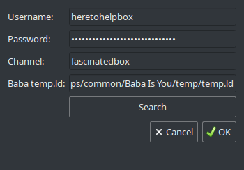
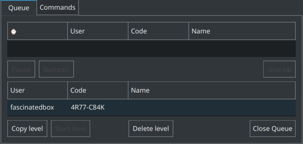
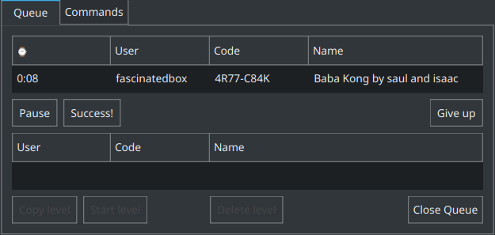
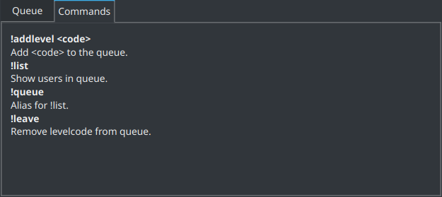
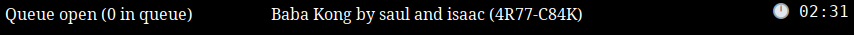

yabba
=====

### Overview

Yabba is a queue management system for Twitch streamers who want to allow
viewers to send custom levelcodes.  

### Why

Before writing Yabba, I briefly used Nightbot along with a queue script to
create a levelcode queue. Yabba provides the following advantages to using a
text-only queue:

**How long have I been here?**: Some custom Baba levels are very challenging
to solve in a time frame that gives everyone a chance. Yabba includes a timer
that shows on the overlay as well as in the program.

**What's the current levelcode?**: Yabba includes an overlay that specifies the
levelcode used as well as a level's name and author.

**Auto copy levelcode**: Yabba loads the levelcode automatically into the
clipboard, no need to hunt through a (busy!) chat.

### How it works

For the overlay, Yabba serves `baba.html` on port 8001. Under the hood, Yabba
has a websocket server 8002 for the overlay to communicate with the server.
